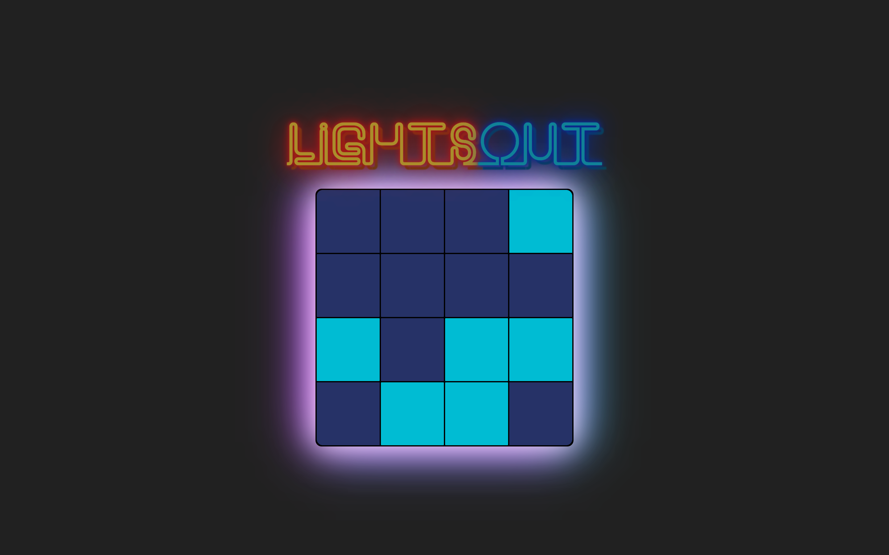

# Lights Out

A simple web game made in React. The goal is to turn off all the lights in the grid!

See the live instance here: https://lightsoutgame.netlify.com/

When you click on a tile, it is toggled on/off, along with its 4 neighbours above, below, left, and right.

